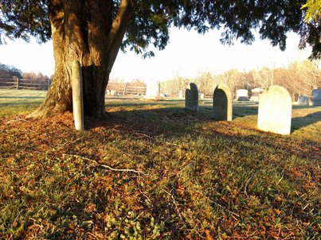

The subsystem that shows up as a cause in every postmortem, but never gets fixed. The source file that begins with
comments by several generations of engineers [warning of the hazard  that lies within](https://www.osti.gov/scitech/biblio/6799619). These are your organization’s haunted graveyards.

A common conversation goes like this -

**Enthusiastic New Person**: _My manager suggested I add better monitoring to the `$scary_thing`, where should I start?"_

**Grumpy Senior Engineer**: _Um, the code is over there, but it's 50,000 lines of spaghetti. The last time we touched it we learned it also processes payroll, and the person who wrote it quit 6 months ago. We just try not to touch it._

**A Different Grumpy Senior Engineer**: _Yup, I looked at fixing it a few years ago and gave up. When it crashes we just restart it and hope it keeps going._

**Great.** Now you have a system so haunted that two senior members on the team refuse to go near it. You’ve chosen to encase it in concrete and warning signs rather than fix it.

This is a huge [trap](https://www.usenix.org/conference/srecon17americas/program/presentation/reilly). If you’re very lucky, you’ll only have to walk into the graveyard for security and platform updates, which are probably <crosses fingers> going to be ok. More likely the system will break spectacularly when you least expect it, and you’ll write a postmortem containing the phrases “technical debt” and “key components with no owner.”

What do you do now? March in with flashlights and throw a party.

# History Class
Find out as much as you can about the system, especially about how it has evolved over time. You want facts,
not tales that get told over `$beverages` after a big outage. Seek out what has been tried before, and *why* those attempts failed. Understand the circumstances, since things are probably different now.

# Information Gathering
Figure out what the `$scary_thing` does and how it interacts with the world. You want to avoid touching the actual system because it is fragile and scary, but get as much data as you can from the outside.

Application, Client, Data, and Network logs can provide indications about what the system expects as inputs and outputs. If logs aren’t available, putting a proxy layer around the system and log everything there (more about that later).

Turn it off and see who yells. This is not recommended for components suspected to be mission critical, but can be
[very illuminating](https://landing.google.com/sre/book/chapters/service-level-objectives.html#xref_risk-management_global-chubby-planned-outage). And it is faster than staring at logs all day.

# Develop A Risk Assessment
Often you’ll find that the circumstances have changed since the last attempt to make progress. Clients of the system may have better resiliency to brief interruptions. You may have moved 80% of the functionality elsewhere.

Look at the downside too: how much scarier do things get if you don’t try and fix this system? Do your Ops people rage-quit from frustration? Does it endanger your next product launch? Is it preventing other systems from improving?

# Change Something Small
You know what the thing does (kinda) and you know what else depends on it (maybe?) so now you can change it. Pick something small: a minor library update, running a code linter, or adding some log lines

Treat the first few changes as incidents before you even start. Write up a plan, gather all the experts in case something goes wrong. Book a conference room (or chat channel) and order take-out.

Write a postmortem, even if everything goes fine.

Rinse, repeat as necessary
A key reason systems become haunted is lack of practice which leads to fear of change.
If a process is scary you should do it frequently until it isn’t scary anymore.

# Proxies and Mirrored Requests
If leaping right in seems too risky, you have another option. Replace the `$scary_thing` with a tiny piece of code that forwards each request to the real thing.

Once this proxy is in place, you can use it for instrumentation or as a tool to deprecate your haunted system.

Here is an example workflow:

1. Replace the `$scary_thing` with a tiny piece of code that forwards each request to the real thing and pushes the response back to the client.
1. Have the proxy log everything it sees (or a sample if there’s a lot of it)
1. Rewrite functionality into the proxy layer. If you’re paranoid, and you should be, run both the old and new workflows and have the proxy log any differences in results.
1. Slowly migrate requests from the `$scary_thing` to the proxy layer which is now actually a rewrite of the functionality of the old thing.
1. Turn off the `$scary_thing`. Have a party.

This process can be slow and requires engineering, but it is much safer and more reliable than trying to do a
[rewrite](https://everythingsysadmin.com/2016/03/wasting-one-million-dollars.html).

# Preventing the Haunting
Ideally your systems should never get into this state. However, here are some tips to help prevent your own `$scary_thing`.

1. Rebuild and deploy code often, even if not much has changed
1. Ensure every component has an owner.
1. Build robust logging and [observability](https://honeycomb.io/blog/2017/11/best-practices-for-observability/)
into everything so you can refer to data rather than lore.
1. Treat technology and platform migrations as real projects, and don't declare them _done_ until all the old
components are gone.

Happy Solstice everyone!
